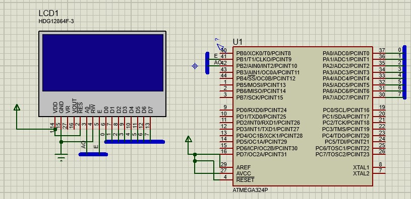
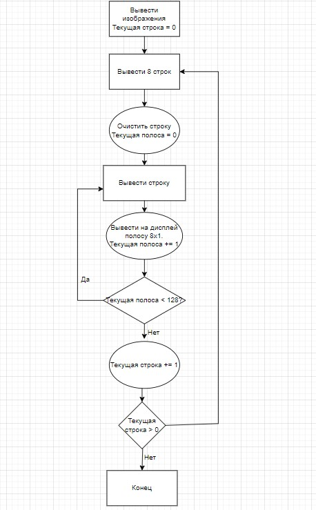
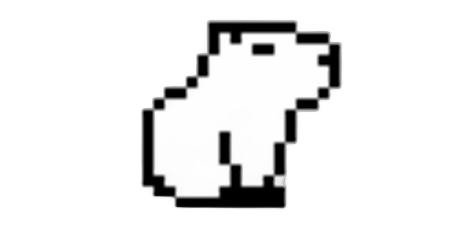
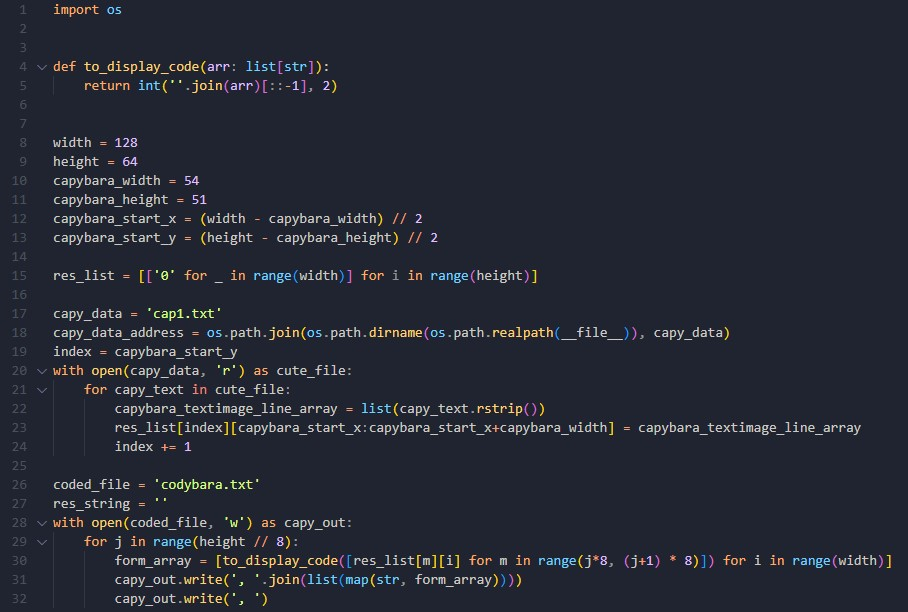
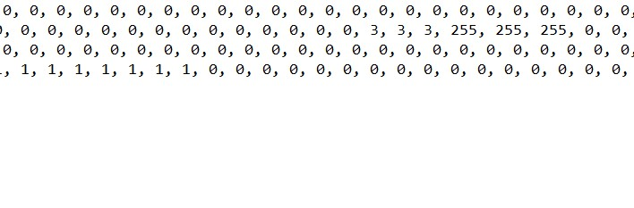

# Вывод изображения на жидкокристаллический дисплей  HDG12864F-3 при помощи микроконтроллера
### Целью проекта является научится работать с интерфейсом микроконтроллера ATmega324PB и внешними переферийными устройствами
>Создано и протестировано  в среде Proteus 8
## Такая задача требует не только написания кода, но и решения следующих подзадач:

### 1. Знакомство с техническими характеристиками дисплея
### 2. Разработка алгоритма вывода изображения на экран (с учётом особенностей дисплея)
### 3. Преобразование исходного изображения в вид, удобный для хранения в FLASH памяти микроконтроллера
### 4. Реализация алгоритма и тестирование

## Часть 1. Знакомство с техническими характеристиками дисплея
Все данные были взяты из даташита, доступного по адресу: https://www.digchip.com/datasheets/parts/datasheet/951/HDG12864F-3-pdf.php

Дисплей осуществляет вывод изображения при помощи динамической индикации, то есть поочерёдно зажигая свои сегменты. Он имеет два режима: режим приёма команд/данных (AO 0/1), команды и данные передаются на дисплей через пины D0-D7, считывание с линий осуществляется при появление падающего фронта на синхровходе Е. 

За раз устройство отображает одну полосу 128x8 пикселей, отображаемые дисплеем данные хранятся в стеке LIFO, размером 1024 бит, в котором единица соответствует зажжённому пикселю, а ноль – потухшему.

Максимальное время считывание данных с портов ввода/вывода – 70 ns, что меньше времени одного такта микроконтроллера ATMega324P – 125 ns.

## Часть 2. Разработка алгоритма вывода изображения на экран (с учётом особенностей дисплея)
Как было сказанно ранее, дисплей поддерживает только динамическую индикацию и за раз может вывести лишь полосу формата 128x8, к тому же каждый раз после вывода одной строки нужно будет обязательно очищать буффер дисплея и лишь после этого переходить к отображению новой строки. Использованный псевдо алгоритм вывода изображения:

## Часть 3. Преобразование исходного изображения в вид, удобный для хранения в FLASH памяти микроконтроллера
Изображения для вывода на дисплее:

Перед тем как изображение могло быть выведено на дисплей при помощи алгоритма нужно решить следующие трудности:
- Размер изображения не соотеветствует размеру дисплея
- Вывод изображения происходит в виде полос размером 1x8
- Полосы 1x8 изображения, для удобства хранения, должны быть конвертированны в десятичные числа

Создания программы на ассемблере, изменяющей изображение, является сложной и почти невыполнимой задачей, поэтому был написан Python скрипт, преводящий вышеуказанное изображение в удобный для чтения микроконтроллером вид.

**Python скрипт**

**Результат конвертации изображения**

## Часть 4. Реализация алгоритма и тестирование

**Реализация алгоритма находится в файле main.asm**

**Тестирование в среде Proteus 8**

