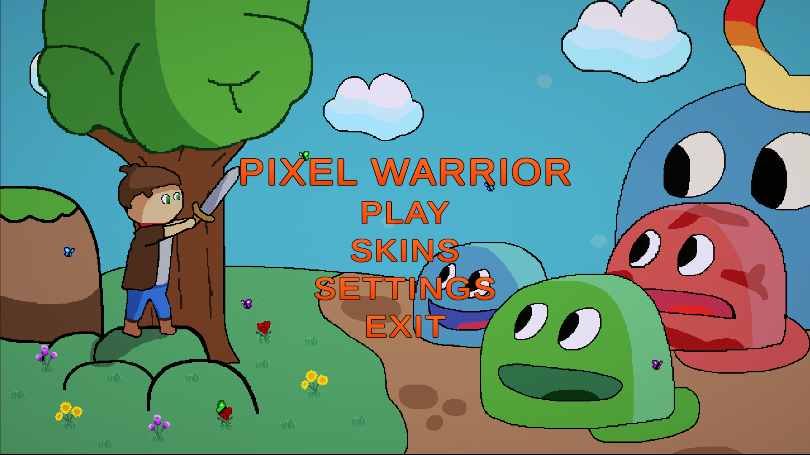
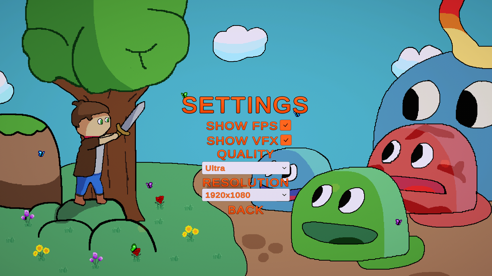
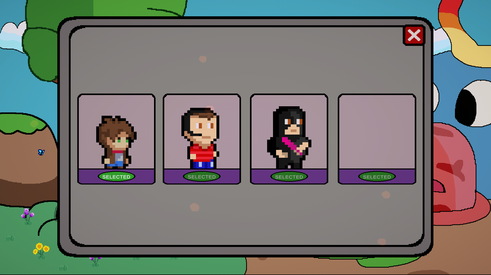
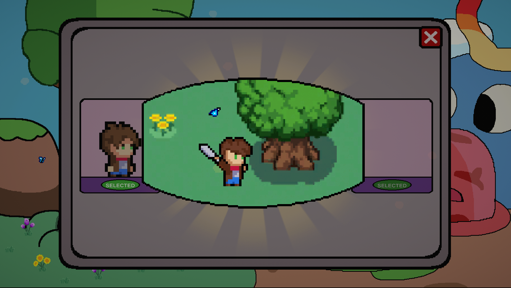
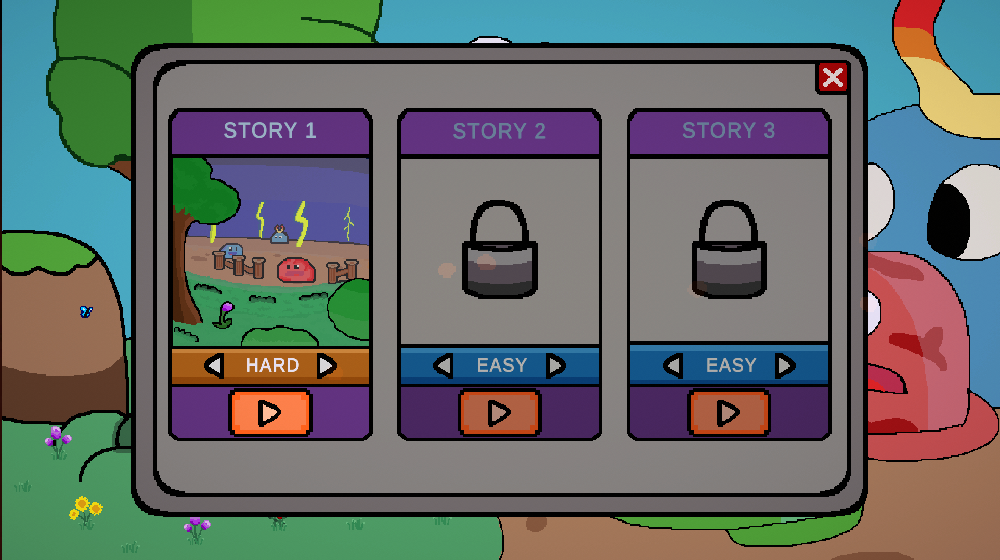
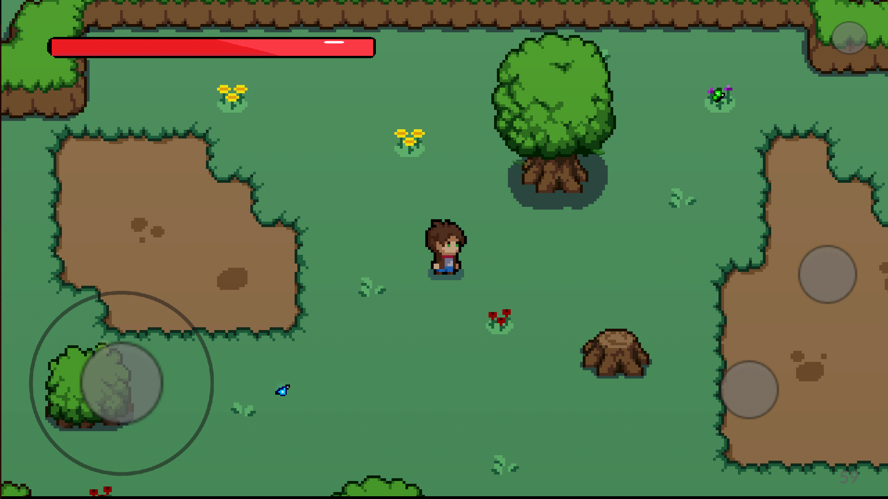
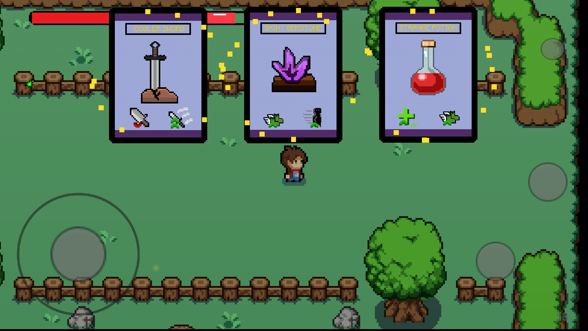
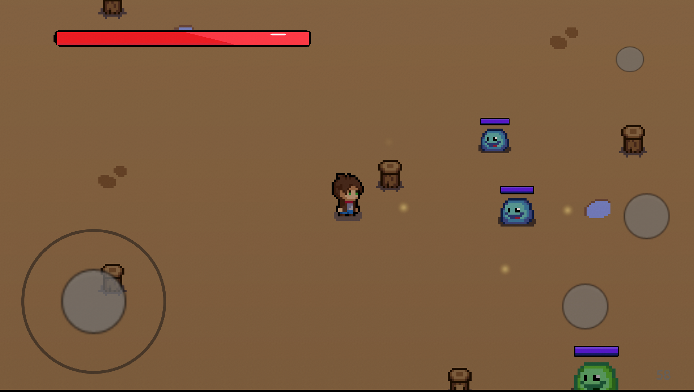
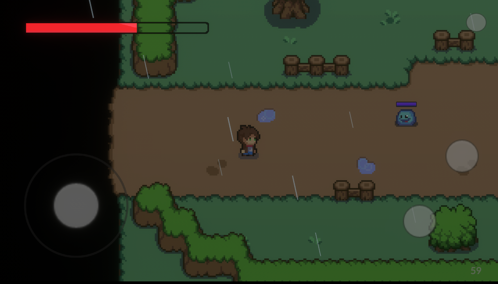
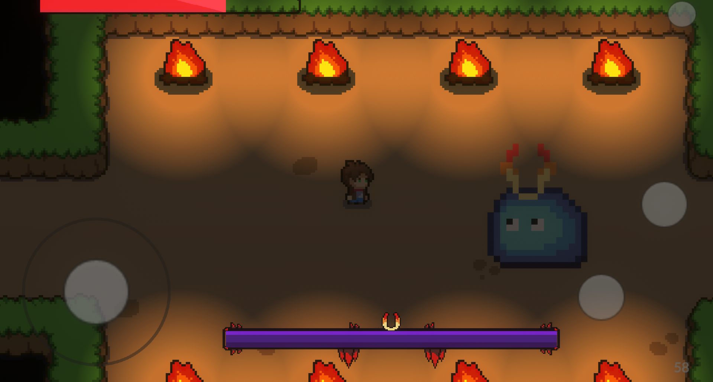

# PixelWarrior
Спрайты и рисунки были сделаны мной (часть из них являются переделанными спрайтами из Asset Store).

Интерес в прокте представляет только подход к написанию кода: он написан в одинаковом стиле (C# Google) и пытается соответствовать принципам SOLID (лишь пытается). Наиболее трудной задачей была оптимизация шейдров, систем частиц для андройд платформы и малопроизводительных телефонов, а также создание главного меню.

### По игровым решениям всё предельно просто:
- Движение соперников - A* package
- Движение персонажа - начало движения при указанном отклонении джойстика
- Перемещение камеры - Cinemachine package
- Анимации персонажа - встроенный в Unity Animator 
- Отдельные настройки слизней для разных сложностей - Данные хранятся в виде ScriptableObject
- Отключение графических эффектов в меню настроек - Отключение игровых объектов
- Шейдры - Встроенные в Unity, не помню

## Скриншоты игры

### Главное меню

### Меню настроек

### Меню скинов

### Демонстрация скинов

### Меню начала игры

### Первая сцена

### Награды за прохождение комнат

### Враги

### Комната с дождём

### Комната с боссом
