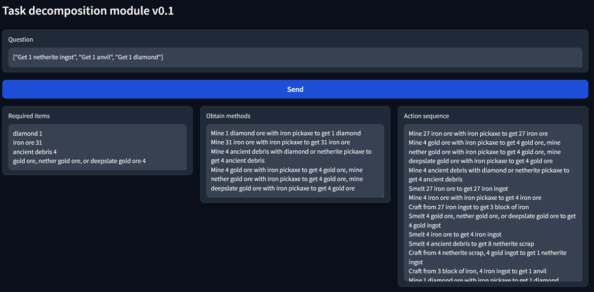
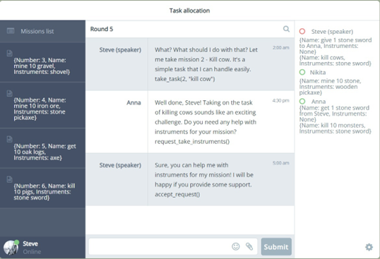
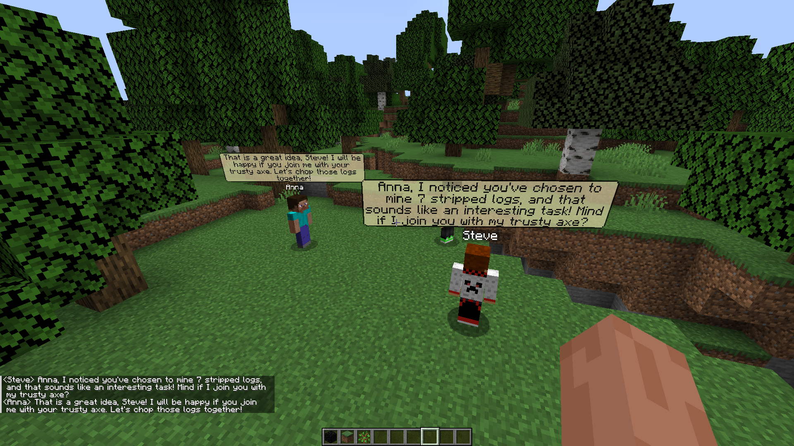
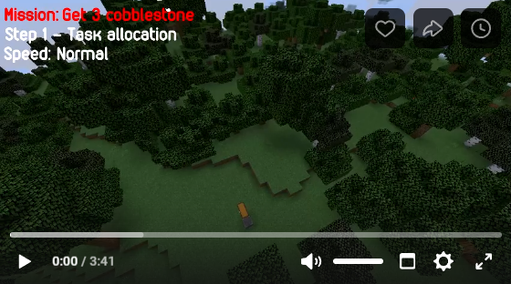

# Embodied multiagent system in minecraft
### Проект по созданию многоагентной системы для выполнения заданий пользователя на основе агента Voyager (https://github.com/MineDojo/Voyager)
### Возможности системы:
- Обработка миссий пользователя - при помощи LLM программа приводит миссию пользователя на естественном языке к виду "действие" "количество" "объект" "условия"
- Декомпозиция миссий - итеративный алгоритм для разделения сложных миссий на простые задачи, которые могут быть выполнены агентами паралельно
- Распределение заданий - агенты в формате разговорного клуба обсуждают выбор задач, а также договариваются о совместном их выполнении
- Два вида кооперативного поведения: помощь с инструментами и совместное выполнение заданий
- Самостоятельная передача добытых ресурсов, после выполнениня миссий

<b>Декомпозиция миссий (/Code/MissionDecomposition)</b>

Планирование действий агентов является одной из самых важных задач многоагентной системы, ведь недостаток хотя бы одного из материалов, в игре майнкрафт будет означать невозможность получения нужного предмета, что в конечном счёте сделает достижение поставленной миссии невозможным.

Чтобы определить все промежуточные этапыб, необходимые для выполнения миссии, используется рекурсивный алгоритм на основе LLM и технологии RAG, который определяет нужные для выполнения миссии ресурсы и инструменты, а затем рекурсивно анализирует эти ресурсы и инструменты, как миссии по их добыче.

Пример декомпозиции миссии: (левый столбец содержит необходимые ресурсы для выполнения миссии, средний - действия, которые нужно осуществить, чтобы добыть эти материалы, правый - последовательность действий для одного агента, осуществление которых позволит выполнить поставленную миссию)  
    

<b>Распределение заданий (/Code/TaskAllocation)</b>

Для решения проблемы распределения заданий, система моделирует процесс общения людей в разговорном клубе.
При помощи LLM говорящий агент выбирает задания из списка, после чего генерирует сообщение, чтобы оповестить других агентов. Остальные агенты оценивают и обсуждают решение. После чего они могут попросить говорящего агента сменить миссию, либо присоединиться к нему или помочь ему с инструментами.  
  
__Простая визуализация процесса распределения заданий:__

__Распределение заданий в игре майнкрафт__

### Видео демонстрация:

