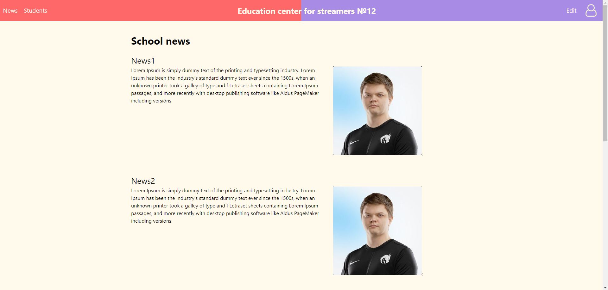
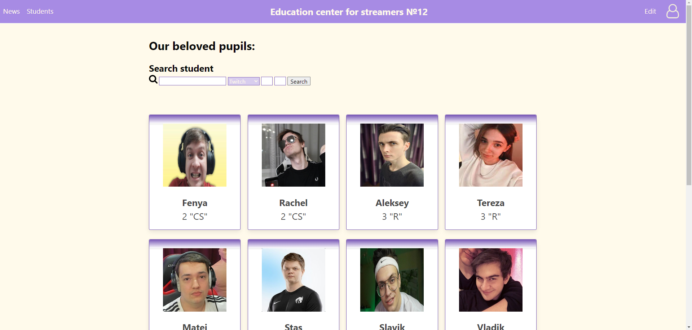
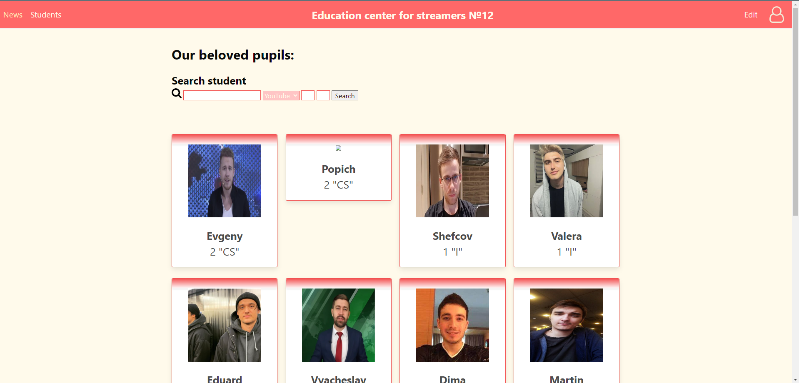
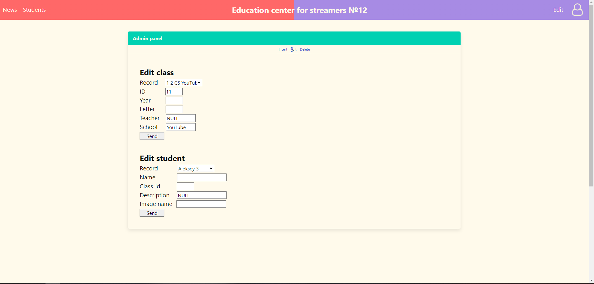
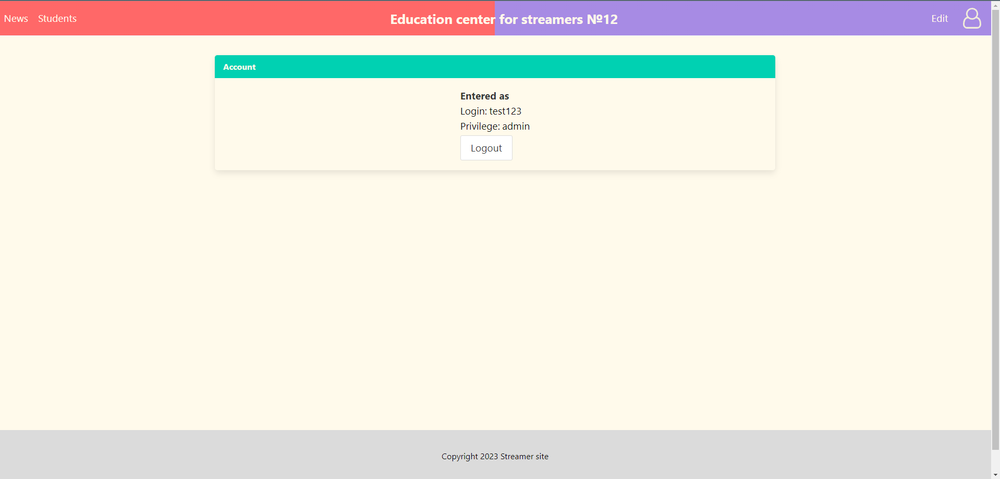

# Семестровая работа студента чешского университета

> Адрес версии, что он сдал преподавателю (почему-то не работает DELETE) https://195.113.207.163/~kokozhan/kokozhan/Seminar%20work%20Seznam%20student%c5%af%20%c5%a1koly/index.php

### Техническое задание
> На выполнение было отведено 5 дней

(Исходный файл не сохранился, поэтому лишь слова однокурсника заказчика и моя интерпретация)

Целью работы является применение знаний, полученных студентом за этот семестр. 
Обязательными условиями является наличие базы данных с как минимум тремя связанными таблицами вместе с возможностью управлять ей через сайт, системы аутентификации и должно быть как минимум три страницы.

Предлагаемые темы работы (переведено с Чешского):
- Прайс-лист товаров для компании
- База данных фильмов 
- База данных компании
- Дискография групп
- Редактирование части содержимого www-страниц с использованием базы данных
- Регистрация автомобиля
- Учет дорожно-транспортных происшествий
- Регистрация номерных знаков ТС (владелец, примечание Зн.)
- Записи о животных
- Учет водителей и их нарушений ПДД
- Информационный сервер
- Расписание
- Культурные мероприятия
- Предложение автосалона
- Предложение товаров компании
- Пищевая ценность продуктов питания
- Интернет-базар
- Календарь планирования
- Прокат компакт-дисков
- Пари
- Список компакт-дисков
- Список должников
- Список регистрации недвижимости (номер, название, местонахождение, дата покупки, цена)
- Список аппаратного и программного обеспечения в компьютерных классах
- Список меню на неделю
- Список книг
- Список проектов в компании
- Список задач для учащихся – использование файлов
- Список интересных ссылок
- **Список учащихся школы**
- Телефонная книга
- Видео магазин
- Вход в конференцию
- Список игроков
- Виртуальное кладбище
- Сайты Альянса
- Рамки

### Решение

Мной была выбрана тема *список учащихся школы*, где основной идеей было создание обучающего центра для стримеров, состоящего из двух школ Twitch и YouTube. База данных, как и требовалось по заданию, имела три таблицы: login, class и student (две последние связаны по ключу Class.id - id класса). Также сайт содержит специальную и доступную только администрацию страницу Edit, где можно добавлять, удалять и изменять записи учеников и даже целые классы.

Небольшие особенности сайта:

- Сайт неплохо отображается на всех устройствах (телефонах, планшетах и персональных компьютерах)
- Есть функция фильтрации записей учеников по различным параметрам (имя, класс, буква класса)
- Смена дизайна сайта и отображаемых учеников при переключении школы (Twitch/YouTube)

### Скриншоты страниц сайта

